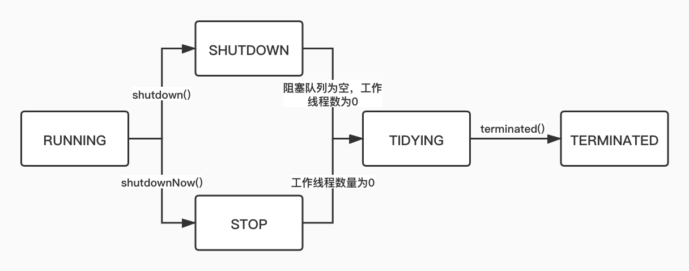

# Java线程池

## 构造线程池参数

```java
public ThreadPoolExecutor(int corePoolSize,
                          int maximumPoolSize,
                          long keepAliveTime,
                          TimeUnit unit,
                          BlockingQueue<Runnable> workQueue,
                          ThreadFactory threadFactory,
                          RejectedExecutionHandler handler)
```

### corePoolSize

线程池核心线程数量，创建线程池后，默认线程池中没有线程，等待有任务到来时，如果线程池数量小于核心线程数量，则创建线程执行任务。（prestartCoreThread()或者prestartAllCoreThreads()方法可以预创建线程）。

### maxPoolSize

线程池最大线程数量，当前线程数量大于等于corePoolSize，且任务队列已满，线程池创建新线程，直到达到最大线程数。

### keepAliveTime

超过核心线程数的线程，在keepAliveTime时间内没有接受新任务，回收线程。allowCoreThreadTimeOut设为true，则核心线程也会回收。

### unit

keepAliveTime的单位。

### workQueue

任务队列，存储等待执行的任务。

### handler

任务拒绝策略，如果任务队列已满，线程池当前线程数量达到maxPoolSize，采取该策略处理提交的新任务。

### threadFactory

使用线程工厂创建线程。

## 线程池任务调度

## 线程池拒绝策略

|      拒绝策略       | 描述                                           |
| :-----------------: | :--------------------------------------------- |
| AbortPolicy（默认） | 丢弃任务，并抛出RejectedExecutionException异常 |
|    DiscardPolicy    | 直接丢弃任务，不抛出异常                       |
| DiscardOldestPolicy | 丢弃任务队列最早的任务                         |
|  CallerRunsPolicy   | 将任务交给调用线程执行                         |

## 线程池状态

|  运行状态  | 状态描述                                                     |
| :--------: | :----------------------------------------------------------- |
|  RUNNING   | 能接受新提交的任务，也能处理阻塞队列中的任务                 |
|  SHUTDOWN  | 不能接受新提交的任务，可以继续处理阻塞队列中的任务           |
|    STOP    | 不能接受新任务，不处理队列中的任务，会中断正在处理任务的线程 |
|  TIDYING   | 所有任务都终止，当前线程数为0                                |
| TERMINATED | 执行完terminated()方法后进入该状态                           |



## JDK五种线程池

Executors类里面提供生成常用线程池的静态方法

### newCachedThreadPool

```java
public static ExecutorService newCachedThreadPool() {
    return new ThreadPoolExecutor(0, Integer.MAX_VALUE,
                                  60L, TimeUnit.SECONDS,
                                  new SynchronousQueue<Runnable>());
}
```

可缓存的线程池，如果线程池的大小超过了处理任务所需要的线程，就会回收空闲60s的线程，当任务数增加时，线程池可以添加新线程来处理任务。

### newSingleThreadExecutor

```java
public static ExecutorService newSingleThreadExecutor() {
    return new FinalizableDelegatedExecutorService
        (new ThreadPoolExecutor(1, 1,
                                0L, TimeUnit.MILLISECONDS,
                                new LinkedBlockingQueue<Runnable>()));
}
```

单线程线程池，保证所有任务的执行顺序按照任务的提交顺序执行。

### newFixedThreadPool

```java
public static ExecutorService newFixedThreadPool(int nThreads) {
    return new ThreadPoolExecutor(nThreads, nThreads,
                                  0L, TimeUnit.MILLISECONDS,
                                  new LinkedBlockingQueue<Runnable>());
}
```

固定大小的线程池，每提交一个任务就创建一个线程，直到线程数量达到固定大小，之后线程数量不发生变化。

### newScheduledThreadPool

```java
public static ScheduledExecutorService newScheduledThreadPool(int corePoolSize) {
    return new ScheduledThreadPoolExecutor(corePoolSize);
}

public ScheduledThreadPoolExecutor(int corePoolSize) {
    super(corePoolSize, Integer.MAX_VALUE, 0, NANOSECONDS,
          new DelayedWorkQueue());
}
```

可执行定时、周期性任务的线程池。

### newWorkStealingPool

```java
public static ExecutorService newWorkStealingPool() {
    return new ForkJoinPool
        (Runtime.getRuntime().availableProcessors(),
         ForkJoinPool.defaultForkJoinWorkerThreadFactory,
         null, true);
}
```

fork/join架构递归地将任务分解为较小的独立子任务，这些任务被添加到并行处理线程的队列中，如果一个线程完成了任务，会从其他线程窃取任务，适合执行很耗时的任务。

